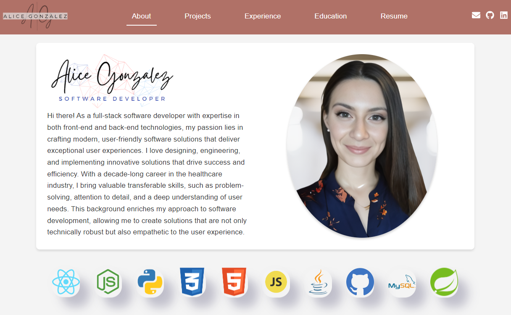

# My Portfolio

Thank you for taking the time to review my portfolio! This portfolio is a living document, and I’m always looking for ways to enhance it.

In this portfolio, you’ll find:
Highlighted Projects: Showcasing my recent work and the technologies I’ve used.
Interactive Timelines: Visual representations of my professional experiences and achievements.
3D Technology: A creative display of the tech tools I’m proficient in.
Continuous Improvement

## Available Scripts

In the project directory, you can run:

### `npm start`

Runs the app in the development mode.\
Open [http://localhost:3000](http://localhost:3000) to view it in your browser.